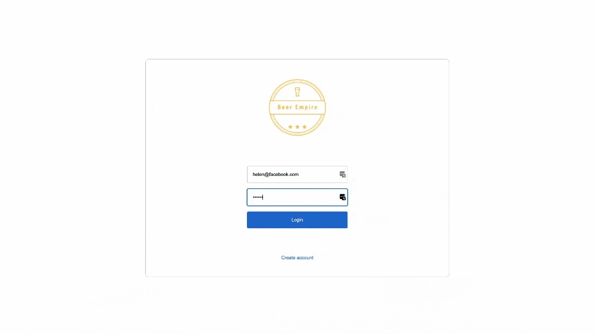

# Beer Empire

## Beer store with admin area using Redux

<p align="center">
 <a href="#features">Features</a> •
 <a href="#demo">App demo</a> •
 <a href="#requirements">Requirements</a> •
 <a href="#technologies">Technologies</a> • 
 <a href="#autor">Author</a>
</p>

<h4 align="center"> 
	Finished project ✅
</h4>

<h1 id="features">Features</h1>

- [x] User register
- [x] Pages restricted to authenticated users
- [x] API request through token authentication
- [x] Shopping cart with quantity and price amount calculation
- [x] Login screen
- [x] Access level (admin, editor and user)
- [x] Register, update and delete of products
- [x] Register and delete of users

<h1 id="demo">App demo</h1>

<h1 align="center">
  
</h1>

<h1 id="requirements">Requirements</h1>

Before starting, you need to install in your machines the following tools:
[Git](https://git-scm.com), [Node.js](https://nodejs.org/en/).
Besides that, is good to have a good code editor as [VSCode](https://code.visualstudio.com/)

### 🎲 Running the backend (server)

```bash
# Clone the backend repository and run the fake api according to the instructions
$ git clone <https://github.com/leandronunesdev/fake-api-empire>

```

### 🎲 Running the Frontend (server)

```bash
# Clone this repository
$ git clone <https://github.com/leandronunesdev/beer_empire>

# Acces the project folder using terminal/cmd
$ cd beer_empire

# Install the dependencies
$ npm install

# Execute the aplication on development mode
$ npm start

# The server will start on port:3000 - access <http://localhost:3000>
```

# Login credentials

## Admin

- email: helen@facebook.com | password: 123123

## Editor

- email: mauricio@google.com | password: 123123

<h1 id="technologies">🛠 Technologies</h1>

The following tools were used on this project:

- [React](https://pt-br.reactjs.org/)
- [TypeScript](https://www.typescriptlang.org/)
- [Redux](https://redux.js.org/)
- [Styled Components](https://styled-components.com/)
- [Material UI](https://mui.com/)

<h1 id="author">🛠 Author</h1>

<a href="https://github.com/leandronunesdev">
 
 <br />
 <sub><b>Leandro Nunes</b></sub></a> <a href="https://github.com/leandronunesdev" title="Leandro">🚀</a>

Made with ❤️ by Leandro Nunes

👋🏽 Reach out!

<a href="https://leandronunes.dev/">Website<a> |
<a href="https://www.linkedin.com/in/nunesprofissional/">Linkedin<a> |
<a href="mailto:https://www.linkedin.com/in/nunesprofissional/">E-mail<a> |
<a href="https://twitter.com/leandro_nunes">Twitter<a>
